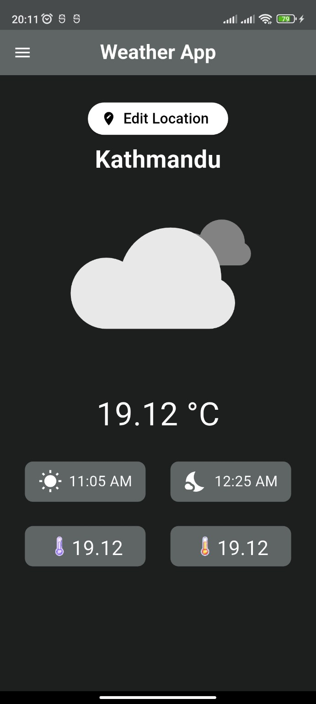

# Weather App

A simple weather application built using **Flutter**. This app provides real-time weather updates for your current location as well as for any selected place on the map. It includes a basic UI and some features to enhance the user experience.

---

## Features

- **Real-Time Weather Updates**  
  Get accurate temperature readings and weather conditions instantly.

- **Automatic Location Detection**  
  The app automatically detects your current location to show relevant weather information.

- **Interactive Map for Location Selection**  
  Search and select any location from the map to view its weather data.

- **Theme Toggle (Light/Dark Mode)**  
  Switch between light and dark modes using a simple toggle button for better readability and personalization.

- **Temperature, Sunrise, and Sunset Details**  
  Displays temperature along with sunrise and sunset timings.

---

## Screenshots

| Settings Page                                | Weather Overview                        | Map Location Picker                |
|----------------------------------------------|-----------------------------------------|------------------------------------|
|  |  |  |

---

## Getting Started

### Prerequisites

- Flutter SDK installed
- Android/iOS device or emulator

### Run the app

```bash
flutter pub get
flutter run
